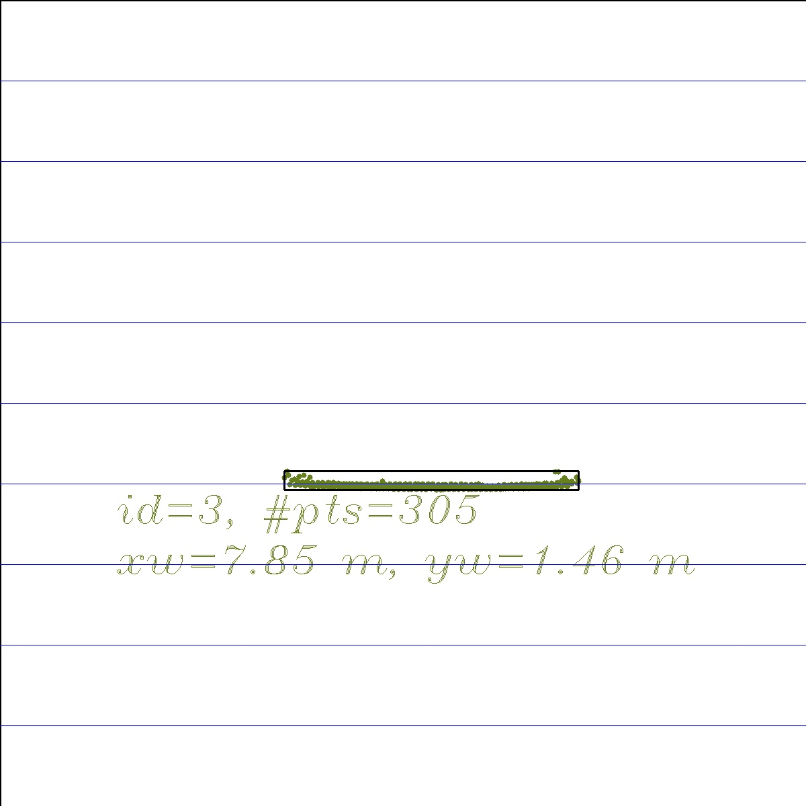
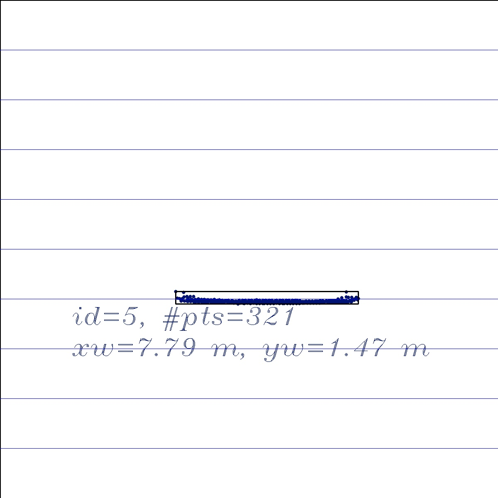
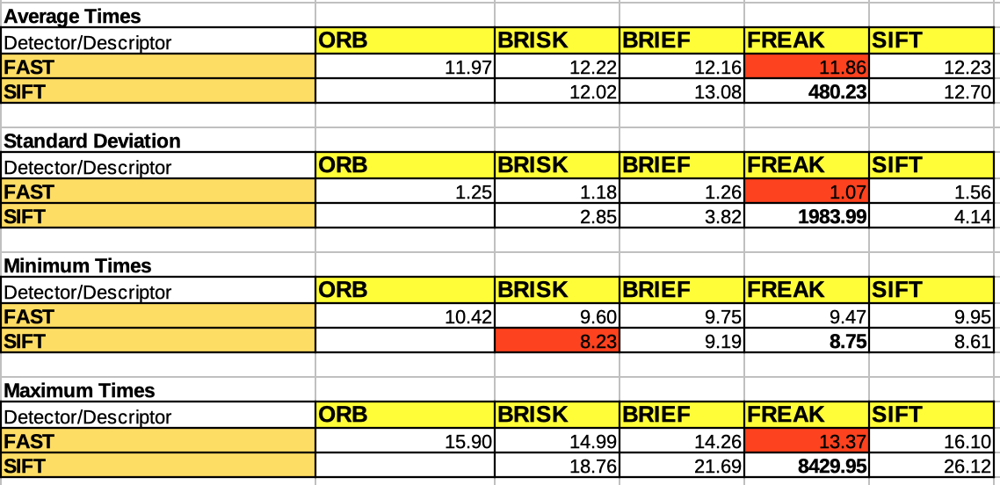

# SFND 3D Object Tracking
 
Welcome to the final project of the camera course. By completing all the lessons, you now have a solid understanding of keypoint detectors, descriptors, and methods to match them between successive images. Also, you know how to detect objects in an image using the YOLO deep-learning framework. And finally, you know how to associate regions in a camera image with Lidar points in 3D space. Let's take a look at our program schematic to see what we already have accomplished and what's still missing.


In this final project, you will implement the missing parts in the schematic. To do this, you will complete four major tasks: 
1. First, you will develop a way to match 3D objects over time by using keypoint correspondences. 
2. Second, you will compute the TTC based on Lidar measurements. 
3. You will then proceed to do the same using the camera, which requires to first associate keypoint matches to regions of interest and then to compute the TTC based on those matches. 
4. And lastly, you will conduct various tests with the framework. Your goal is to identify the most suitable detector/descriptor combination for TTC estimation and also to search for problems that can lead to faulty measurements by the camera or Lidar sensor. In the last course of this Nanodegree, you will learn about the Kalman filter, which is a great way to combine the two independent TTC measurements into an improved version which is much more reliable than a single sensor alone can be. But before we think about such things, let us focus on your final project in the camera course. 

## Dependencies for Running Locally
* cmake >= 2.8
  * All OSes: [click here for installation instructions](https://cmake.org/install/)
* make >= 4.1 (Linux, Mac), 3.81 (Windows)
  * Linux: make is installed by default on most Linux distros
  * Mac: [install Xcode command line tools to get make](https://developer.apple.com/xcode/features/)
  * Windows: [Click here for installation instructions](http://gnuwin32.sourceforge.net/packages/make.htm)
* Git LFS
  * Weight files are handled using [LFS](https://git-lfs.github.com/)
* OpenCV >= 4.1
  * This must be compiled from source using the `-D OPENCV_ENABLE_NONFREE=ON` cmake flag for testing the SIFT and SURF detectors.
  * The OpenCV 4.1.0 source code can be found [here](https://github.com/opencv/opencv/tree/4.1.0)
* gcc/g++ >= 5.4
  * Linux: gcc / g++ is installed by default on most Linux distros
  * Mac: same deal as make - [install Xcode command line tools](https://developer.apple.com/xcode/features/)
  * Windows: recommend using [MinGW](http://www.mingw.org/)

## Basic Build Instructions

1. Clone this repo.
2. Make a build directory in the top level project directory: `mkdir build && cd build`
3. Compile: `cmake .. && make`
4. Run it: `./3D_object_tracking`.

## FP.1 Match 3D Objects
###### Implement the method "matchBoundingBoxes", which takes as input both the previous and the current data frames and provides as output the ids of the matched regions of interest (i.e. the boxID property). Matches must be the ones with the highest number of keypoint correspondences.

The logic for this went like this.
1. From the previous frame, create a lookup of keypoint index to the bounding
   box.
2. Do the same for the current frame.
3. Use the match object to map the query index (previous keypoint) to the
   training index (current keypoint).

Since copies are made every time we stove the objects into data structures, I
chose to use pointers. The over all code is shown below:

```
void matchBoundingBoxes(const std::vector<cv::DMatch> & matches, 
        std::map<int, int> &bbBestMatches, 
        const DataFrame & prevFrame, const DataFrame & currFrame)
{
    std::unordered_map<int, BoundingBoxID> prevMapping = 
        prepareKeyPointBoundingBoxID(prevFrame); //query
    std::unordered_map<int, BoundingBoxID> currMapping = 
        prepareKeyPointBoundingBoxID(currFrame); //train
    convertMatchesToBBoxes(matches, prevMapping, currMapping, bbBestMatches);
}

```

The details of the code are in camFusion_Student.cpp.
##FP.2 Compute Lidar-based TTC

###### Compute the time-to-collision in second for all matched 3D objects using only Lidar measurements from the matched bounding boxes between current and previous frame.

The code is shown in camFusion_Student.cpp

##FP.3 Associate Keypoint Correspondences with Bounding Boxes
###### Compute the time-to-collision in second for all matched 3D objects using only keypoint correspondences from the matched bounding boxes between current and previous frame.

Code in camFusion_Student.cpp

##FP.4 Compute Camera-based TTC
######Compute the time-to-collision in second for all matched 3D objects using only keypoint correspondences from the matched bounding boxes between current and previous frame.

Code in camFusion_Student.cpp

##FP.5 Performance Evaluation 1
######Find examples where the TTC estimate of the Lidar sensor does not seem plausible. Describe your observations and provide a sound argumentation why you think this happened.

First off, let us look at the results we got when we worked with the entire
LIDAR data.

|TTC Lidar|TTC Camera|
|---------|----------|
|12.5156  |13.5993|
|12.6142  |13.7007|
|14.091   |12.0507|
|16.6894  |12.4201|
|15.9082  |12.7784|
|12.6787  |14.1624|
|11.9844  |12.6681|
|13.1241  |13.2998|
|13.0241  |11.4417|
|11.1746  |13.9931|
|12.8086  |11.0543|
|8.95978  |11.7391|
|9.96439  |11.4732|
|9.59863  |11.5744|
|8.57352  |8.76284|
|9.51617  |11.9075|
|9.54658  |11.4707|
|8.3988   |8.98367|

If we look closely at entries at lines 2 and 3, 7 and 8, and 13 and 14, we note
that the images show not much has changed. But the TTC for Lidar has jumped
big. 

Topview of Frame #2 vs Frame #3



The remaining pictures can be seen in the reports folder under
3dObject_<number>.jpg.

Could this be due to the fact we are taking median of the entire data set? The
answer is a definite no. 

Median of Nearest 50 Lidar Points
|TTC Lidar|TTC Camera|
|---------|----------|
|12.5265  |13.5993   |
|13.2616  |13.7007   |
|13.1617  |12.0507   |
|16.3521  |12.4201   |
|16.2521  |12.7784   |
|13.122   |14.1624   |
|13.2483  |12.6681   |
|11.7215  |13.2998   |
|13.2666  |11.4417   |
|11.0206  |13.9931   |
|12.39    |11.0543   |
|9.94596  |11.7391   |
|9.9822   |11.4732   |
|9.12405  |11.5744   |
|8.79873  |8.76284   |
|8.80876  |11.9075   |
|10.2633  |11.4707   |
|8.20832  |8.98367   |

One can see implausible jumps in the table above between number 4 and 5. Number
13 and 14 (frame numbers) have shown no discernable improvement at all. 

The reason may be because the x part of the Lidar data may not be accurate. 
There might also be Lidar points that may belong to other vehicles. Look at the
image TTC_14.jpg in the report folder, where we can see the possibility that
the car in the right lane ahead might have its points counted in the current
car.

## FP.6 Performance Evaluation 2
######Run several detector / descriptor combinations and look at the differences in TTC estimation. Find out which methods perform best and also include several examples where camera-based TTC estimation is way off. As with Lidar, describe your observations again and also look into potential reasons.


